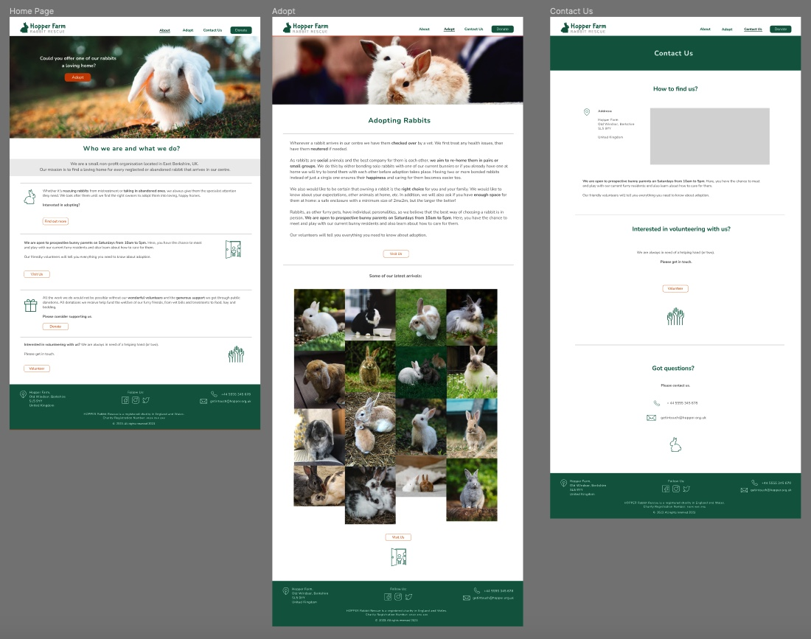
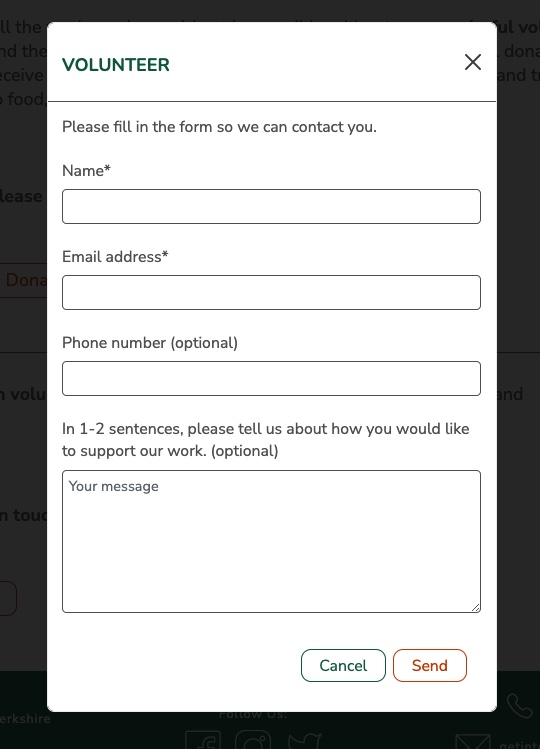
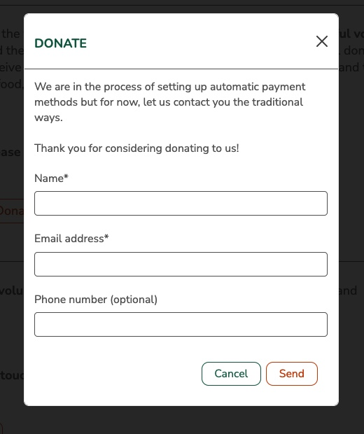
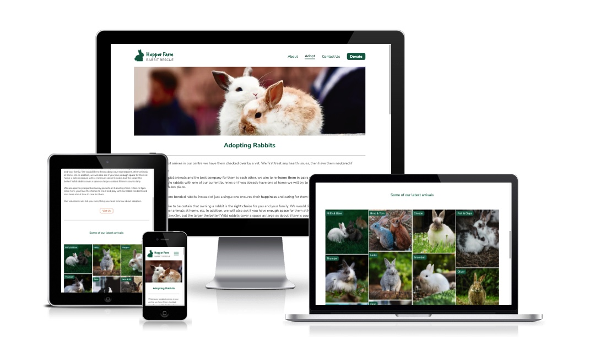

# Website for Hopper Farm Rabbit Rescue - ReactJS project

This project was created by transfoming my `HTML5-CSS3-BOOTSTRAP5` project into a `React JS / Redux` project. The original website was built for Code Institute's web application development course as the 1st Milestone Project (User Centric Frontend Development Project). Design is created with `Figma`.
  

---

### [View the live project here](https://hopper-farm-rabbit-rescue.web.app)

---
 

**Hopper Farm Rabbit Rescue** is a fictional non-profit organisation. The website is designed to support the charity's primary mission which is to help find new homes for rescued pet rabbits.
  

---
 

## CONTENTS

* [User Experience](#user-experience-ux)
  * [Webite Owner's Goals](#website-owners-goals)
  * [Website Visitors' Goals](#website-visitors-goals)

* [Design](#design)
  * [Colour Scheme](#colour-scheme)
  * [Typography](#typography)
  * [Imagery](#imagery)
  * [Wireframes](#wireframes)
  * [High Fidelity Prototype](#high-fidelity-prototype)

* [Features](#features)
  * [General Features](#general-features)
  * [About Page](#about-page)
  * [Adopt Page](#adopt-page)
  * [Contact Us Page](#contact-us-page)
  * [Future Implementations](#future-implementations)
  * [Accessibility](#accessibility)

* [Technologies Used](#technologies-used)
  * [Languages and Libraries Used](#languages-and-libraries-used)
  * [Other Tools & Programs Used](#other-tools-and-programs-used)

* [Deployment & Local Development](#deployment-&-local-development)
  * [Deployment](#deployment)
  * [Forking the GitHub Repository](#forking-the-github-repository)
  * [Making a Local Clone](#making-a-local-clone)

* [Testing](#testing)

* [Credits](#credits)
  * [Main Images](#main-images)
  * [Gallery Images](#gallery-images)
  * [Icons](#icons)
  * [Other Credits](#other-credits---incorporated-ideas-and-solutions)
  * [Acknowledgments](#acknowledgments)
  
---
 

# User Experience (UX)

## Website Owner's Goals

* To help people find the organisation for the primary purpose of rehoming a rescued rabbit.
* To help find potential donors and volunteers willing to contribute to the charity's work.
* To help visitors to make contact with the organisation through various channels.
* The website to have simple structure and clear 'call to action' messages.
* The website to be responsive to all screen sizes as well as light/dark mode preferences.

## Website Visitors' Goals

* To find the relevant piece of information quickly, be it about rabbit adoption, volunteering or donation.
* To be able to make contact with the charity for relevant requests effectively.
* To be able to find the location quickly.
* To be able to access the website in any screen sizes.
* To read the site comfortably when dark mode is preferrable.
---
 

# Design

All wireframes and design were created in [Figma](https://www.figma.com/).
  

## Colour Scheme

Animal charities most frequently use green as their primary colour and I kept the site in line with this customer expectation. I chose orange as an accent colour to emphasize the 'call to action' messages. In addition, I used various shades of greys to complement the two main colours.

I sampled the primary and the accent colours from the hero image of the landing page, then I slightly modified them to satisfy accessibility requirements. 

  

## Typography

A font pairing website [Typ.io](https://typ.io/lists) helped me make typograpy choice.
I selected [Nunito](https://fonts.google.com/specimen/Nunito) and [Nunito Sans](https://fonts.google.com/specimen/Nunito+Sans) from the [Google Fonts](https://fonts.google.com/) library for their simplicity and legibility yet fairly informal feel. To complement these simple styled main fonts, for the feature logo I chose a more decorative typeface, [Bubblegum Sans](https://fonts.google.com/specimen/Bubblegum+Sans).
  

## Imagery

All the **images** appearing on the site are unlicenced, sourced from [Pexels](https://pexels.com/) and [Unsplash](https://unsplash.com/). All pictures have been converted to `.webp` format to reduce file size and as such, reduce loading time. To further increase performance, more image sizes are available for the browser to load the most appropriate one for any screen resolutions. For older browsers that don't recognise `.webp` format, `.png` images were added as backups. This method makes sure that for every device, the best size and resolution will be chosen to achieve the best possible performance.

All **icons** are in .svg format that is lightweight in size, scales perfectly and certain properties can be set programatically. I needed these properties to make them capable to respond to dark-mode preferences. Some of the icons I drew myself in Figma, the others I downloaded from [svgrepo](https://svgrepo.com/). These latter icons are either unlicenced or open-source. All icons were drawn or edited to be uniform in design as well as responsive to dark mode or - as in the case of the rabbit icon - to screen size changes. All icons' colour is set programatically width css.

All references to the images and icons that have been sourced from other sites can be found in the [credits](#credits) section.
  

## Wireframes - Figma

Wireframes were created in [Figma](https://www.figma.com/).

[Live link to wireframe for mobile](https://www.figma.com/proto/wQoFSgRQCECwxqL7hL9q3C/Rabbit_rescue_design?page-id=329%3A62&node-id=329%3A680&viewport=914%2C3013%2C1.76&scaling=min-zoom&starting-point-node-id=329%3A619)
 

 

[Live link to wireframe for desktop](https://www.figma.com/proto/wQoFSgRQCECwxqL7hL9q3C/Rabbit_rescue_design?page-id=329%3A64&node-id=329%3A66&viewport=230%2C162%2C0.3&scaling=min-zoom&starting-point-node-id=329%3A66)
 

  

## High Fidelity Prototype - Figma

I created high fidelity prototypes with Figma, for both mobile and desktop screens. 

[Live link to HiFi Prototype for mobile](https://www.figma.com/proto/wQoFSgRQCECwxqL7hL9q3C/Rabbit_rescue_design?page-id=329%3A63&node-id=352%3A881&viewport=534%2C46%2C0.28&scaling=min-zoom&starting-point-node-id=352%3A881)
 

 

[Live link to HiFi Prototype for desktop](https://www.figma.com/proto/wQoFSgRQCECwxqL7hL9q3C/Rabbit_rescue_design?page-id=329%3A65&node-id=329%3A214&viewport=223%2C207%2C0.3&scaling=min-zoom&starting-point-node-id=329%3A214)
 

---
 

# Features

The website comprises of three pages: `About` page, `Adopt` page and a `Contact Us` page. In addition, I added two overlay modals with forms for `volunteering` and `donation` as well as a `thank you` modal to appear after a successful form submission.

Dark mode is implemented throughout all pages to satisfy the website owner's UX requirement.
  

## General features
 

### Header
 

The **header** is responsive to all screen sizes. On large screens, it expands horizontally, while on mobile and narrower screens the menu bar is replaced with a `burger` icon. Clicking this icon would make the menu appear as a side bar.

A hover effect gives the user feedback about the menu choices. The logo can be clicked from any pages to lead the user back to the home page.

  

**Header on small screens:**
 

  

**Side bars are opening from the burger menu icon:**
 

### Footer
 

The **footer** features all contact information as well as links to social media pages. Calls and Emails can be directly initiated by clicking on the links.

  

### Modals and Forms
 

The **Volunteer** and the **Donate form** pop-ups can be triggered from more pages. 
  

**Volunteer form:**
 

  

**Donate form:**
 

 

In the forms, `Name` is validated to be min 1 character long while `Email` is validated to have a proper email fomat. After passing all validations and submission of either of the forms, a `thank you modal` is triggered to appear. 
 

  

**Favicons** are also responsive to light / dark mode preferences. I drew the light mode icon myself, but used [RealFaviconGenerator](https://realfavicongenerator.net/svg-favicon/) to transform it into dark mode sensitive favicons.
  

  

---

## About Page
 

The `About page` is the place where all important information and links can be found. Decorative icons help the user find the desired information effectively.
 

  

---

## Adopt Page
 

The `Adopt page` provides essential information about rabbit re-homing. Its aim is to encourage the user to make the next step in the adoption process and visit the centre. To support this goal, I included a rabbit gallery as well as `Visit Us buttons` to lead the user to the `Contact Us page`. 
 

  
---

## Contact Us Page
 

On the `Contact Us page`, I included all the contact information the organisation can be reached from. Alongside the address, a live Google Maps frame helps with orientation.

The submission of a `Volunteer form` is another way of contacting the charity, so it features on this page as well.

Lastly, active links are provided for both calling and emailing the organisation.
 

  
---

## Future Implementations
 

* Further development could be a new page dedicated entirely to listing individual rabbits waiting for adoption. It would be implemented with a comprehensive database and backend server. The backend server could be accepting and processing the data coming from any contact channels.

  
---

## Accessibility
 

* To aid screen readers: 
  * `Semantic HTML` were used throughout all pages.

  * All images have descriptive `alt` attributes and all other elements that have implied meanings are labelled with `aria-labels` .

  * Current pages and modals are also labelled with the appropriate `aria properties` to help navigation.

* Fonts were chosen to be simple with clean contours to maximize legibility. 

* For font-sizes, `rem` were used throughout the site to allow the text to scale according to the users' preferred default font-size.

* All colours were tested beforehand to have sufficient contrast with the help of [Color Palette Contrast Checker](https://color-contrast-checker.deque.com/).
  

---

# Technologies Used
 

## Languages and Libraries Used
 

The site was built with the [JavaScript](https://www.javascript.com) library [ReactJS](https://reactjs.org) version 18.2.0, [React Router](https://reactrouter.com/en/main) version 6.6.2 and [React-Redux](https://react-redux.js.org) version 8.0.5.

## Other Tools & Programs Used
 

* [Figma](https://www.figma.com/) 
  - to create the design.

* [Git](https://git-scm.com/) & [Github](https://github.com/) 
  - for version control, safe storage and deployment.

* [Google Fonts](https://fonts.google.com/) 
  - to import fonts into the stylesheet.

* [Typ.io](https://typ.io/lists)
  - to make typography choice.

* [Google Map Generator](https://google-map-generator.com/) 
  - to generate Google Map iframe to address.

* [Google Dev Tools](https://developer.chrome.com/docs/devtools/) 
  - for testing and troubleshooting.

* [CloudConvert](https://cloudconvert.com/jpg-converter) 
  - to convert images to .webp format.

* [Color Palette Contrast Checker](https://color-contrast-checker.deque.com/)
  - to check colours have sufficient contrast.
  
* [RealFaviconGenerator](https://realfavicongenerator.net/svg-favicon/) 
  - to generate dark mode responsive favicons.

* [Am I Responsive?](https://ui.dev/amiresponsive) 
  - to create site visuals for responsive design.

* [Gyazo](https://gyazo.com) 
  - for adding .gif file to this README
  
---

# Deployment & Local Development
 

This project was bootstrapped with [Create React App](https://github.com/facebook/create-react-app).

## Available Scripts
 
In the project directory, you can run:

### `npm start`

Runs the app in the development mode.\
Open [http://localhost:3000](http://localhost:3000) to view it in your browser.

The page will reload when you make changes.\
You may also see any lint errors in the console.

### `npm test`

Launches the test runner in the interactive watch mode.\
See the section about [running tests](https://facebook.github.io/create-react-app/docs/running-tests) for more information.

### `npm run build`

Builds the app for production to the `build` folder.\
It correctly bundles React in production mode and optimizes the build for the best performance.

The build is minified and the filenames include the hashes.\
Your app is ready to be deployed!

See the section about [deployment](https://facebook.github.io/create-react-app/docs/deployment) for more information.
  

### `npm run eject`

**Note: this is a one-way operation. Once you `eject`, you can't go back!**
 
If you aren't satisfied with the build tool and configuration choices, you can `eject` at any time. This command will remove the single build dependency from your project.

Instead, it will copy all the configuration files and the transitive dependencies (webpack, Babel, ESLint, etc) right into your project so you have full control over them. All of the commands except `eject` will still work, but they will point to the copied scripts so you can tweak them. At this point you're on your own.

You don't have to ever use `eject`. The curated feature set is suitable for small and middle deployments, and you shouldn't feel obligated to use this feature. However we understand that this tool wouldn't be useful if you couldn't customize it when you are ready for it.
  

### Deployment

This Project is deployed on Firebase.

Steps to deploy a Static project, refer to the Firebase documentation.

Steps to re-deploy an updated project:

1. `npm run build` to build app for production
2. Login to Firebase with: `firebase login`.
3. `firebase hosting:disable` to stop the current version runnning.
4. `firebase deploy` to deploy the project.

These steps can also be automated with `Github Actions` when configuring the deployment for the first time. 

  
If `npm run build` fails to minify: [https://facebook.github.io/create-react-app/docs/troubleshooting#npm-run-build-fails-to-minify](https://facebook.github.io/create-react-app/docs/troubleshooting#npm-run-build-fails-to-minify)

  

# Testing

Please view [TESTING.md](TESTING.md) for more information on testing.

---
  

# Credits
 

## Main images
 

* [Hero image](https://www.pexels.com/photo/close-up-view-of-white-rabbit-10595503/): Photo by Ali Atakan Açıkbaş on [Pexels](https://pexels.com/)

* Adopting page image: Photo by [Lorna Ladril](https://unsplash.com/@lorna_ladril?utm_source=unsplash&utm_medium=referral&utm_content=creditCopyText) on [Unsplash](https://unsplash.com/s/photos/rabbits?utm_source=unsplash&utm_medium=referral&utm_content=creditCopyText) 
  

## Gallery images
 

* ["Fluff & Bunbun" photo](https://www.pexels.com/photo/white-and-brown-rabbits-on-bed-6846043/) by Tima Miroshnichenko on [Pexels](https://pexels.com/)

* ["Jack & Jill" photo](https://www.pexels.com/photo/close-up-photo-of-rabbits-playing-11702024/) by Şeyma Dalar on [Pexels](https://pexels.com/) 

* "Fish & Chips" photo by [Pure Julia](https://unsplash.com/@purejulia?utm_source=unsplash&utm_medium=referral&utm_content=creditCopyText) on [Unsplash](https://unsplash.com/s/photos/rabbits?utm_source=unsplash&utm_medium=referral&utm_content=creditCopyText)
  
* "Miffy & Olive" photo by [Andriyko Podilnyk](https://unsplash.com/@andriyko?utm_source=unsplash&utm_medium=referral&utm_content=creditCopyText) on [Unsplash](https://unsplash.com/s/photos/rabbits?utm_source=unsplash&utm_medium=referral&utm_content=creditCopyText)
  
* "Holly" photo by [Janan Lagerwall](https://unsplash.com/@stuffinabox?utm_source=unsplash&utm_medium=referral&utm_content=creditCopyText) on [Unsplash](https://unsplash.com/s/photos/rabbits?utm_source=unsplash&utm_medium=referral&utm_content=creditCopyText)
  
* "Teddy" photo by [Satyabratasm](https://unsplash.com/@smpicturez?utm_source=unsplash&utm_medium=referral&utm_content=creditCopyText) on [Unsplash](https://unsplash.com/s/photos/rabbits?utm_source=unsplash&utm_medium=referral&utm_content=creditCopyText)
  
* "Lola" photo by [Matt Pike](https://unsplash.com/@mjp_tw?utm_source=unsplash&utm_medium=referral&utm_content=creditCopyText) on [Unsplash](https://unsplash.com/s/photos/rabbits?utm_source=unsplash&utm_medium=referral&utm_content=creditCopyText)

* "Cinnabun" photo by [Daniel McCarthy @themccarthy](https://unsplash.com/@danielmccarthy?utm_source=unsplash&utm_medium=referral&utm_content=creditCopyText) on [Unsplash](https://unsplash.com/s/photos/rabbits?utm_source=unsplash&utm_medium=referral&utm_content=creditCopyText)

* "Hopper" photo by [Sandy Millar](https://unsplash.com/@sandym10?utm_source=unsplash&utm_medium=referral&utm_content=creditCopyText) on [Unsplash](https://unsplash.com/s/photos/rabbits?utm_source=unsplash&utm_medium=referral&utm_content=creditCopyText)

* "Chester" photo by [Misha Walker](https://unsplash.com/@misharose?utm_source=unsplash&utm_medium=referral&utm_content=creditCopyText) on [Unsplash](https://unsplash.com/s/photos/rabbits?utm_source=unsplash&utm_medium=referral&utm_content=creditCopyText)

* "Thumper" photo by [Chan Swan](https://unsplash.com/ja/@moyathebunny?utm_source=unsplash&utm_medium=referral&utm_content=creditCopyText) on [Unsplash](https://unsplash.com/s/photos/rabbits?utm_source=unsplash&utm_medium=referral&utm_content=creditCopyText)
  
* "Daisy" photo by [Gabriel Miklós](https://unsplash.com/@gebgramm?utm_source=unsplash&utm_medium=referral&utm_content=creditCopyText) on [Unsplash](https://unsplash.com/s/photos/rabbits?utm_source=unsplash&utm_medium=referral&utm_content=creditCopyText)

* "Oreo" photo by [Li Yan](https://unsplash.com/@yanli247?utm_source=unsplash&utm_medium=referral&utm_content=creditCopyText) on [Unsplash](https://unsplash.com/s/photos/rabbits?utm_source=unsplash&utm_medium=referral&utm_content=creditCopyText)

* "Oliver" photo by [Jacob Amson](https://unsplash.com/@jacobamson?utm_source=unsplash&utm_medium=referral&utm_content=creditCopyText) on [Unsplash](https://unsplash.com/s/photos/rabbits?utm_source=unsplash&utm_medium=referral&utm_content=creditCopyText)

* "Snowball" photo by [Pablo Martinez](https://unsplash.com/@pablomp?utm_source=unsplash&utm_medium=referral&utm_content=creditCopyText) on [Unsplash](https://unsplash.com/s/photos/rabbits?utm_source=unsplash&utm_medium=referral&utm_content=creditCopyText)
  
* ["Brno and Tom" photo](https://www.pexels.com/photo/gray-and-brown-bunnies-8891763/) by Мария on [Pexels](https://www.pexels.com) 
  

## Icons
 

All downloaded icons have been edited.

* Visitors icon: https://www.svgrepo.com/svg/18735/class-open-door (Unlicenced)

* Gift icon: https://www.svgrepo.com/svg/61094/gift (Unlicenced)

* Helping hands icon: https://www.svgrepo.com/svg/76123/voluntary-service (Unlicenced)

* Facebook icon: https://www.svgrepo.com/svg/176882/facebook-social-media (Unlicenced)

* Twitter icon: https://www.svgrepo.com/svg/389481/twitter (Open Soruce MIT licence)

* Location icon: https://www.svgrepo.com/svg/309741/location (Open Soruce MIT licence)

* Phone icon: https://www.svgrepo.com/svg/425344/phone-1 (Unlicenced)

  

## Other credits - incorporated ideas and solutions
 

* making svg icons responsive: https://css-tricks.com/cascading-svg-fill-color/ by Chris Coyier https://css-tricks.com/author/chriscoyier/

* making Google Maps iframes responsive to dark mode: https://codepen.io/kuranopen/pen/oNjMqGN

* using images in HTML in different sizes to improve performance:
https://css-tricks.com/responsive-images-youre-just-changing-resolutions-use-srcset/ 
https://ausi.github.io/respimagelint/docs.html 
https://medium.com/@woutervanderzee/responsive-images-with-srcset-and-sizes-fc434845e948 
https://stackoverflow.com/questions/68191793/specify-explicit-width-and-height-for-picture-tag 
https://www.cssmine.com/blog/2020-02-12-css-object-fit-and-object-position-properties-crop-images-embedded-in-html 

* adding backup image in .png format for older Safari users
https://stackoverflow.com/questions/58487035/how-to-add-webp-support-in-safari-browser

* improving accessibility: https://web.dev/how-to-review/

  

## Content
 

* I wrote all content myself, however, I drew inspiration from the following sites:

  [The Littlest Lives Rescue](https://thelittlestlivesrescue.org.uk)

  [South Coast Rabbit Rescue](https://www.southcoastrabbitrescue.co.uk)

  [Essex Guinie Pig, Rat and Rabbit Rescue](https://www.egprr.org)

* Content for Deployment and Development of this README file was written using [Code Institute's sample README file](https://raw.githubusercontent.com/Code-Institute-Solutions/SampleREADME/master/README.md).
  

##  Acknowledgements
 

* My family and friends who took the time to test my site.

* Code Institute's Slack Community for continuous support.

  

##  Disclaimer
 

This project was created with the sole purpose of writing a personal portfolio project.
 
Not for public use.
 
Szilvia Csernusne Berczes, Jan 2023.
All rights reserved.
