# Full Stack Web Application for Hopper Farm Rabbit Rescue

> **Hopper Farm Rabbit Rescue** is a fictional non-profit organisation.
The website is designed to support the charity's primary mission which is to help find new homes for rescued pet rabbits. Admins can add/edit/delete rabbit records. Users can get information about the work of the charity, the adoption process as well as individual rabbits which are listed for adoption.

**This App is a `Full Stack` `Progressive Web App (PWA)`, `installable` and `fully responsive` on all devices.**

The Frontend is implemented with `React JS, Redux, React-Router, CSS Modules, HTML5` and `Figma` for design.
Payment is implemented with `STRIPE Link`.
The Backend is built with `Django REST` and the database with `PostgreSQL`.
The `EmailJS` API is used to send forms. Dark mode is implemented throughout all pages.

---

***View the live project here: https://rabbit-rescue-be99746cd4ef.herokuapp.com***

---
 

> I originally created the frontend of this project for Code Institute's Web Application Development Course as the 1st Milestone Project (User Centric Frontend Development Project) in `HTML5-CSS3-BOOTSTRAP5`, which can be found [here](https://github.com/szilvia-csernus/rabbit-sanctuary).
---

# Features

The frontend of this project is a `Single Page Application (SPA)`. React-Router was used to render three pages: `About` page, `Adopt` page and a `Contact Us` page. In addition, I added  modals for displaying the `volunteering form` and the `rabbit enquiry form` as well as the `thank you` and `error` messages.

I also implemented `Progressive Web App (PWA)` features such as caching and installability.

# Installation

Installation on Desktop is available through the "install" icon in the brwoser's search bar.

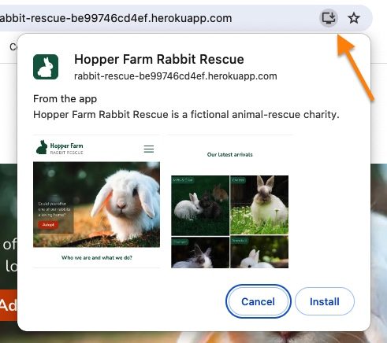

On Android devices, there is an "Install app" menu item in the side menu:

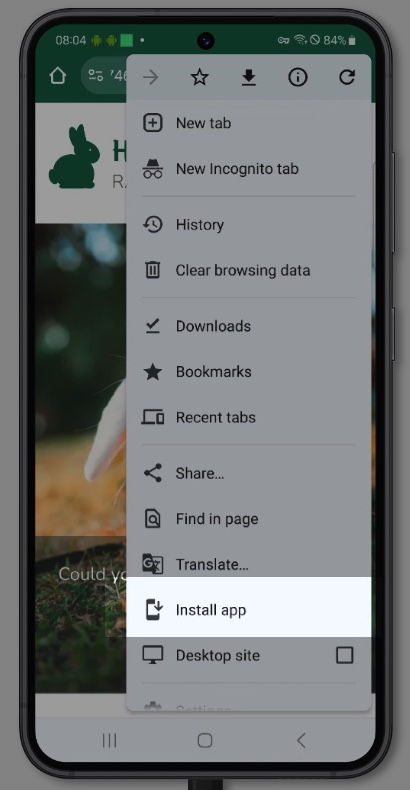
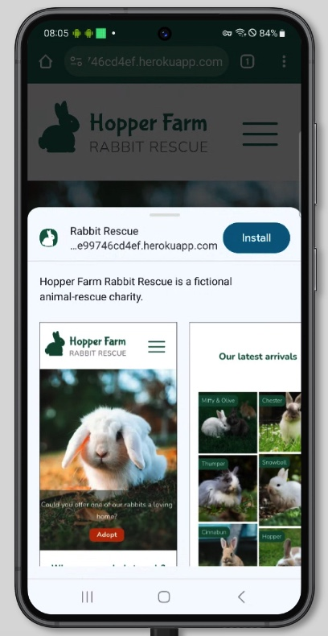

On iOS and iPadOS devices, installation is only available from Safari through
the "Add To Home Screen" menu item.

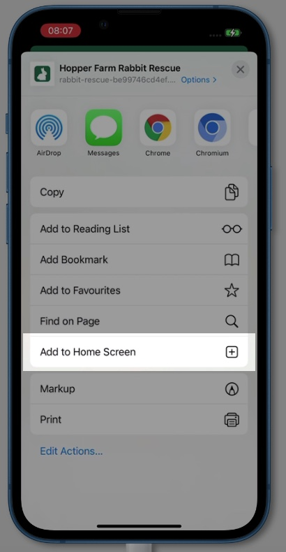
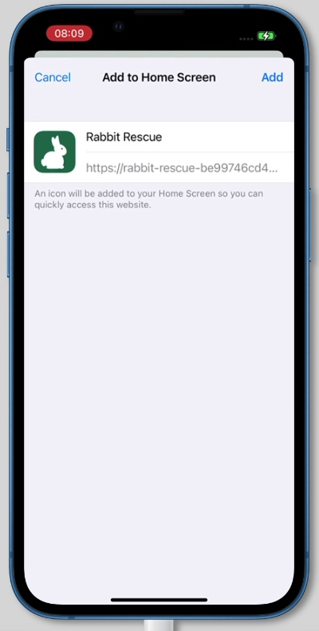

This is how the icons appear accross various devices:

|iPhone|Safari|Android|Windows|
|:-:|:-:|:-:|:-:|
|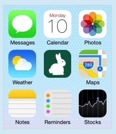||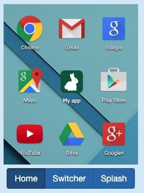|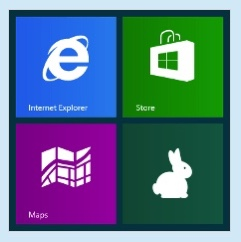|

## Landing Page (About)

Side bars open from the burger menu icon:

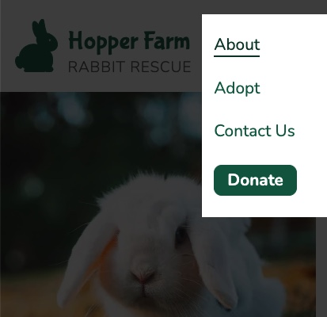

## Dark-mode responsive SVG icons

All **icons** are in `SVG` format that allowed me to set their colours programatically to respond to dark mode.

|Rabbit|Gift|People|Hands|
|:-:|:-:|:-:|:-:|
|||||
|||||

Similarly, the Favicons respond to dark mode too:

---

## Adopt Page
 

The `Adopt page` provides essential information about rabbit re-homing and also includes a gallery, listing all rabbits from the database that are eligible for adoption. 
 

The user can click on the rabbit pictures to get more information:

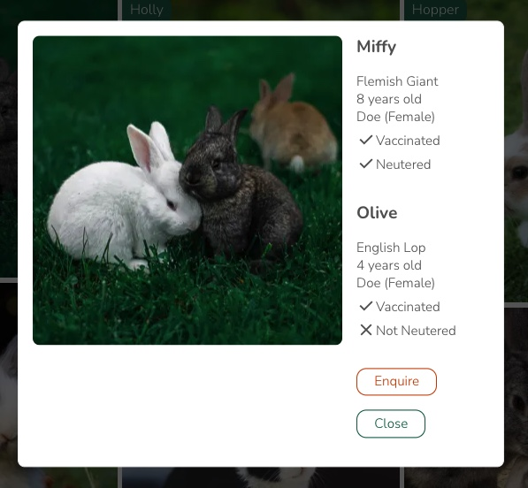

When clicking `Enquire`, an Enquiry Form appears:

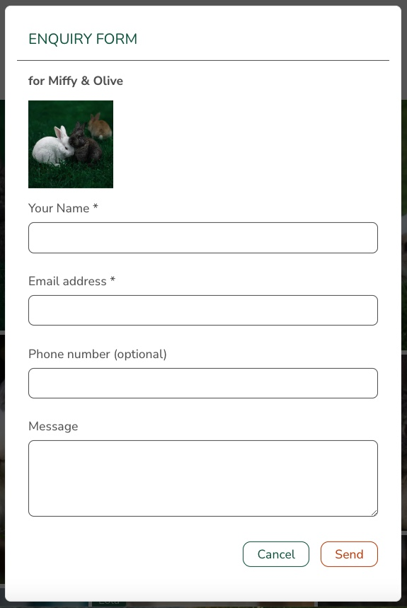

The 'Name' and the 'Email' fields are required fields:

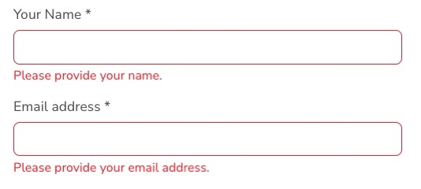

A 'Thank You Message' notifies the user of a successful form submission:

---

## Contact Us Page
 

On the `Contact Us page`, I included all the contact information the organisation can be reached from. Alongside the address, a live Google Maps frame helps with orientation.

The submission of a `Volunteer form` is another way of contacting the charity:

|Volunteer Form - Light|Volunteer Form - Dark|
|:-:|:-:|
|||

---

## Donation Payments

I used the `Stripe Link` API for secure donation payments:

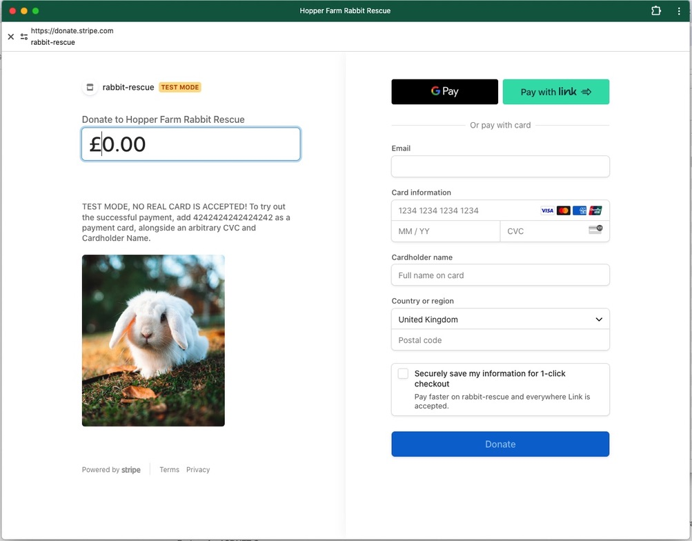

|Success Message - Light|Success Message - Dark|
|:--:|:--:|
||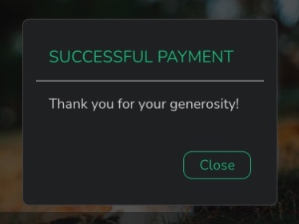|

---

# Data

## Schema

The relational database is built with `PostgreSQL` and Django's object-model system. I'm utilizing Django's built-in `auth` app and the `admin` panel, where users with `staff` permissions can add/edit/delete rabbit records.

The data model for rabbits comprises of 3 tables. As adoption of rabbits often happens in groups, I planned to list these rabbits together on the website. For this, I needed a `rabbit_group` model, which can include one or more individual rabbits. Similarly, the `image` model belongs to the rabbit_group, not to the individual rabbit, as the rabbits are often pictured together, not individually.

## Fixtures

I wrote a python script, `generate_fixtures.py`, to generate random data for my database. With this, I generated three json fixtures which I then used to load the records into the database:

- `rabbit_groups.json`
- `rabbits.json`
- `rabbit_images.json`

---

# Admin Functions

Admin functions are available through Django's built-in `admin-panel`. As this is part of my backend application, I configured the frontend-serving Nginx server to proxy-route the user here from the Frontend site. The link for this can be found in the `Footer` section of the site:

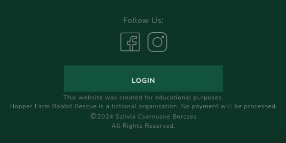

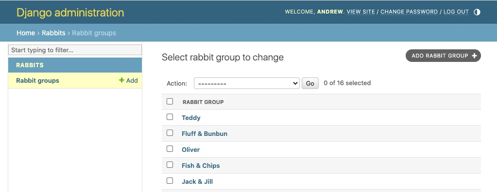
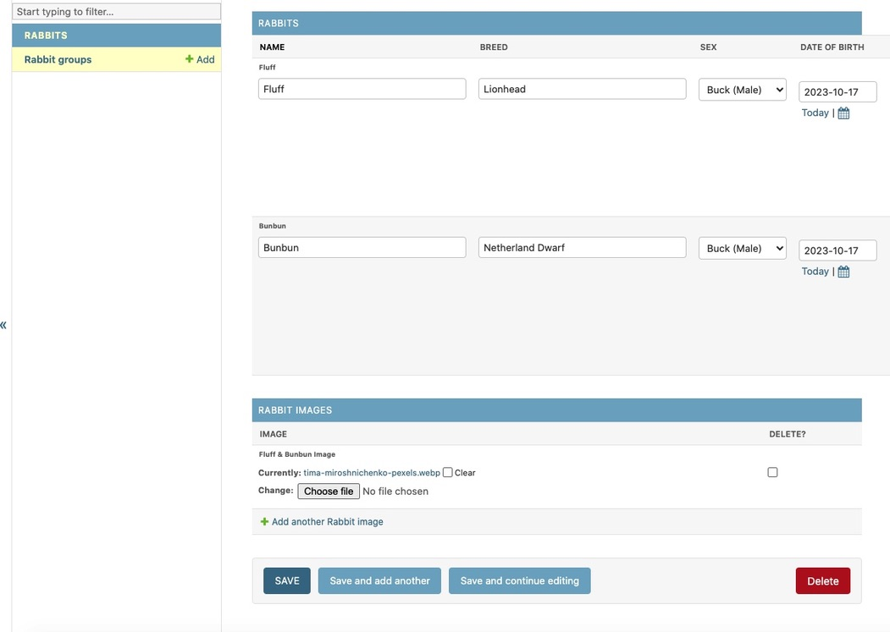

---

# Progressive Web App

I implemented PWA to allow the user to install the app, as well as to cache the static files to decrease subsequent loading times.

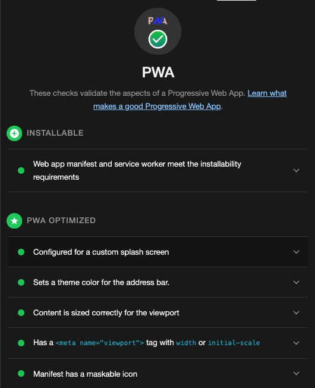

---

# Local Development

To run and develop this project locally, the following steps are needed.

## Backend

0. Prerequisite: Make sure that `python` is installed.
1. Clone the repo.
2. Create a virtual environment in the root folder: `python3 -m venv venv`
3. Activate this environment with either a prompt from the IDE or with `source venv/bin/activate`
4. `cd backend` and install the python packages: `pip install -r requirements.txt`
5. Start the dev server: `python manage.py runserver`

The backend project will be available on the default django port: http://localhost:8000

## Frontend

0. Prerequisite: Make sure that `node` is installed.
1. From the root folder, `cd frontend` and install all packages with `npm install`.
2. Start the development server with `npm start`

The frontend project will be running on the default Vite port: http://localhost:5173

---

# Testing

Please view [TESTING.md](TESTING.md) for more information on testing.

---

# Deployment

Both the backend and the Frontend are deployed on Heroku, in eco dynos. (As this is the most economical tier, the initial loading time is fairly long when the user visits the site for the first time.)

## Backend

The django project is running on a `Gunicorn` server. The django projects' `CORS` and `CSRF` settings make sure that the Frontend can initiate communication.
In the `Procfile`, I specified the commands that are needed after the build process: run all migrations and start up the Gunicorn server.

Environment variables:
+ SECRET_KEY
+ DATABASE_URL
+ CLOUDINARY_URL
+ FRONTEND_URL (raquired for the CORS and CSRF settings in settings.py)
+ BACKEND_HOST (required for the ALLOWED_HOSTS setting in settings.py)

## Frontend

To build the frontend project for production, we can utilize the built-in `npm run build` script, that builds the React app for production. We can run this locally and the run the project with `npm run preview` to test the production version locally.

In Heroku, I used the `nodejs` buildpack to run this process automatically with the help of the "heroku-postbuild" script which I included into the `package.json` file.

As a second step, I used an `nginx` buildpack to serve my frontend with the Nginx server. I included a config file for this (frontend/config/nginx.conf.erb). I configured this server to proxy-route my api requests (rabbit data requests) to the backend server. I also proxy-routed the requests for 'admin' (and the 'static' files that belong to the admin panel) so that the charity owner can reach the admin site from the Frontend.

As Environment variables, I used
+ BACKEND_URL (used for proxy-routing)
+ STRIPE_URL (for payments)

---

# CI/CD with Github Actions

I automated the deployment process by utilizing Github Actions Workflows. On every `push` action, my `main.yml` file first runs all the automated tests and only if they pass deploys the application, backend and frontend into their own respective Heroku dynos.

The result of the latest deployment is represented with this badge:

---

# User Experience (UX)

## Website Owner's Goals

* To help people find the organisation for the primary purpose of rehoming a rescued rabbit.
* To help find potential donors and volunteers willing to contribute to the charity's work.
* To help visitors to make contact with the organisation through various channels.
* The website to have simple structure and clear 'call to action' messages.
* The website to be responsive to all screen sizes as well as light/dark mode preferences.
* Allow the user to gain more information and send enquiry about individual rabbits.
* Allow the visitor to Donate money to the organisation securely.

## Website Visitors' Goals

* To find the relevant piece of information quickly, be it about rabbit adoption, volunteering or donation.
* To find specific information about individual rabbits and be able to express interest in adopting them.
* To be able to make contact with the charity for relevant requests effectively.
* To be able to find the location quickly.
* To be able to access the website in any screen sizes.
* To read the site comfortably when dark mode is preferrable.
---
 

# Design

All wireframes and design were created in [Figma](https://www.figma.com/).
  

## Colour Scheme

Animal charities most frequently use green as their primary colour and I kept the site in line with this customer expectation. I chose orange as an accent colour to emphasize the 'call to action' messages. In addition, I used various shades of greys to complement the two main colours.

I sampled the primary and the accent colours from the hero image of the landing page, then I slightly modified them to satisfy accessibility requirements. 

  

## Typography

A font pairing website [Typ.io](https://typ.io/lists) helped me make typograpy choice.
I selected [Nunito](https://fonts.google.com/specimen/Nunito) and [Nunito Sans](https://fonts.google.com/specimen/Nunito+Sans) from the [Google Fonts](https://fonts.google.com/) library for their simplicity and legibility yet fairly informal feel. To complement these simple styled main fonts, for the feature logo I chose a more decorative typeface, [Bubblegum Sans](https://fonts.google.com/specimen/Bubblegum+Sans).
  

## Imagery

All the **images** appearing on the site are unlicenced, sourced from [Pexels](https://pexels.com/) and [Unsplash](https://unsplash.com/). All pictures have been converted to `.webp` format to reduce file size and as such, reduce loading time. To further increase performance, more image sizes are available for the browser to load the most appropriate one for any screen resolutions. For older browsers that don't recognise `.webp` format, `.png` images were added as backups. This method makes sure that for every device, the best size and resolution will be chosen to achieve the best possible performance.

Some of the icons I drew myself in Figma, the others I downloaded from [svgrepo](https://svgrepo.com/). These latter icons are either unlicenced or open-source. All icons were drawn or edited to be uniform in design as well as responsive to dark mode or - as in the case of the rabbit icon - to screen size changes. All icons' colour is set programatically width css.

All references to the images and icons that have been sourced from other sites can be found in the [credits](#credits) section.
  

## Wireframes - Figma

Wireframes were created in [Figma](https://www.figma.com/).

[Live link to wireframe for mobile](https://www.figma.com/proto/wQoFSgRQCECwxqL7hL9q3C/Rabbit_rescue_design?page-id=329%3A62&node-id=329%3A680&viewport=914%2C3013%2C1.76&scaling=min-zoom&starting-point-node-id=329%3A619)
 

 

[Live link to wireframe for desktop](https://www.figma.com/proto/wQoFSgRQCECwxqL7hL9q3C/Rabbit_rescue_design?page-id=329%3A64&node-id=329%3A66&viewport=230%2C162%2C0.3&scaling=min-zoom&starting-point-node-id=329%3A66)
 

  

## High Fidelity Prototype - Figma

I created high fidelity prototypes with Figma, for both mobile and desktop screens. 

[Live link to HiFi Prototype for mobile](https://www.figma.com/proto/wQoFSgRQCECwxqL7hL9q3C/Rabbit_rescue_design?page-id=329%3A63&node-id=352%3A881&viewport=534%2C46%2C0.28&scaling=min-zoom&starting-point-node-id=352%3A881)
 

 

[Live link to HiFi Prototype for desktop](https://www.figma.com/proto/wQoFSgRQCECwxqL7hL9q3C/Rabbit_rescue_design?page-id=329%3A65&node-id=329%3A214&viewport=223%2C207%2C0.3&scaling=min-zoom&starting-point-node-id=329%3A214)
 

---
 

## Future Implementations
 

* Replacing the `EmailJS` API with a setup of an SMTP service provider such as Google MAIL.
* Building a comprehensive Admin interface in the Frontend.
* Infinite scroll implementation for listing rabbits, in case the numbers increase significantly.

---

## Accessibility
 

* To aid screen readers: 
  * `Semantic HTML` were used throughout all pages.

  * All images have descriptive `alt` attributes and all other elements that have implied meanings are labelled with `aria-labels`.

  * Current pages and modals are also labelled with the appropriate `aria properties` to help navigation.

* `Lighthouse` score for `Accessibility` are **100%** across all pages. Detailed results can be found [here](TESTING.md#lighthouse-tests).

* Contrasts were checked with [a11y Contrast Checker](https://color.a11y.com/Contrast/). All pages passed the test, detailed results can be found [here](TESTING.md#accessibility-tests).

---

# Technologies Used

## Frontend
The site was built with the [JavaScript](https://www.javascript.com) library [ReactJS](https://reactjs.org) v18.2.0, [React Router](https://reactrouter.com/en/main) v6.6.2 and [React-Redux](https://react-redux.js.org) v8.0.5.

## Backend

The [Django REST](https://www.django-rest-framework.org/) Python framework was used for the backend, as well as [PostgreSQL](https://www.postgresql.org/) for the database.

## APIs

[Stripe Link](https://stripe.com/gb/payments/link) for payments and [EmailJS](https://www.emailjs.com/) for sending forms.

## Hosting

* [Heroku](https://heroku.com) - both backend and frontend are hosted on Heroku (eco dynos)

* [Cloudinary](https://cloudinary.com/) - database images are hosted on Cloudinary (free tier)

* [Clever Cloud](https://www.clever-cloud.com/) - PostgreSQL database is hosted on the Clever Cloud platfrom (free tier)

## Other Tools & Programs Used
 

* [Figma](https://www.figma.com/)  - to create the design.

* [Git](https://git-scm.com/) & [Github](https://github.com/) - for version control, safe storage and deployment.

* [Google Fonts](https://fonts.google.com/) - to import fonts into the stylesheet.

* [Typ.io](https://typ.io/lists) - to make typography choice.

* [Google Map Generator](https://google-map-generator.com/) - to generate Google Map iframe to address.

* [Google Dev Tools](https://developer.chrome.com/docs/devtools/) - for testing and troubleshooting.

* [CloudConvert](https://cloudconvert.com/jpg-converter) - to convert images to .webp format.

* [Color Palette Contrast Checker](https://color-contrast-checker.deque.com/) - to check colours have sufficient contrast.
  
* [RealFaviconGenerator](https://realfavicongenerator.net/svg-favicon/) - to generate dark mode responsive favicons.

* [Am I Responsive?](https://ui.dev/amiresponsive) - to create site visuals for responsive design.

---

# Credits

## Main images

* [Hero image](https://www.pexels.com/photo/close-up-view-of-white-rabbit-10595503/): Photo by Ali Atakan Açıkbaş on [Pexels](https://pexels.com/)

* Adopting page image: Photo by [Lorna Ladril](https://unsplash.com/@lorna_ladril?utm_source=unsplash&utm_medium=referral&utm_content=creditCopyText) on [Unsplash](https://unsplash.com/s/photos/rabbits?utm_source=unsplash&utm_medium=referral&utm_content=creditCopyText) 

## Gallery images

* ["Fluff & Bunbun" photo](https://www.pexels.com/photo/white-and-brown-rabbits-on-bed-6846043/) by Tima Miroshnichenko on [Pexels](https://pexels.com/)

* ["Jack & Jill" photo](https://www.pexels.com/photo/close-up-photo-of-rabbits-playing-11702024/) by Şeyma Dalar on [Pexels](https://pexels.com/) 

* "Fish & Chips" photo by [Pure Julia](https://unsplash.com/@purejulia?utm_source=unsplash&utm_medium=referral&utm_content=creditCopyText) on [Unsplash](https://unsplash.com/s/photos/rabbits?utm_source=unsplash&utm_medium=referral&utm_content=creditCopyText)
  
* "Miffy & Olive" photo by [Andriyko Podilnyk](https://unsplash.com/@andriyko?utm_source=unsplash&utm_medium=referral&utm_content=creditCopyText) on [Unsplash](https://unsplash.com/s/photos/rabbits?utm_source=unsplash&utm_medium=referral&utm_content=creditCopyText)
  
* "Holly" photo by [Janan Lagerwall](https://unsplash.com/@stuffinabox?utm_source=unsplash&utm_medium=referral&utm_content=creditCopyText) on [Unsplash](https://unsplash.com/s/photos/rabbits?utm_source=unsplash&utm_medium=referral&utm_content=creditCopyText)
  
* "Teddy" photo by [Satyabratasm](https://unsplash.com/@smpicturez?utm_source=unsplash&utm_medium=referral&utm_content=creditCopyText) on [Unsplash](https://unsplash.com/s/photos/rabbits?utm_source=unsplash&utm_medium=referral&utm_content=creditCopyText)
  
* "Lola" photo by [Matt Pike](https://unsplash.com/@mjp_tw?utm_source=unsplash&utm_medium=referral&utm_content=creditCopyText) on [Unsplash](https://unsplash.com/s/photos/rabbits?utm_source=unsplash&utm_medium=referral&utm_content=creditCopyText)

* "Cinnabun" photo by [Daniel McCarthy @themccarthy](https://unsplash.com/@danielmccarthy?utm_source=unsplash&utm_medium=referral&utm_content=creditCopyText) on [Unsplash](https://unsplash.com/s/photos/rabbits?utm_source=unsplash&utm_medium=referral&utm_content=creditCopyText)

* "Hopper" photo by [Sandy Millar](https://unsplash.com/@sandym10?utm_source=unsplash&utm_medium=referral&utm_content=creditCopyText) on [Unsplash](https://unsplash.com/s/photos/rabbits?utm_source=unsplash&utm_medium=referral&utm_content=creditCopyText)

* "Chester" photo by [Misha Walker](https://unsplash.com/@misharose?utm_source=unsplash&utm_medium=referral&utm_content=creditCopyText) on [Unsplash](https://unsplash.com/s/photos/rabbits?utm_source=unsplash&utm_medium=referral&utm_content=creditCopyText)

* "Thumper" photo by [Chan Swan](https://unsplash.com/ja/@moyathebunny?utm_source=unsplash&utm_medium=referral&utm_content=creditCopyText) on [Unsplash](https://unsplash.com/s/photos/rabbits?utm_source=unsplash&utm_medium=referral&utm_content=creditCopyText)
  
* "Daisy" photo by [Gabriel Miklós](https://unsplash.com/@gebgramm?utm_source=unsplash&utm_medium=referral&utm_content=creditCopyText) on [Unsplash](https://unsplash.com/s/photos/rabbits?utm_source=unsplash&utm_medium=referral&utm_content=creditCopyText)

* "Oreo" photo by [Li Yan](https://unsplash.com/@yanli247?utm_source=unsplash&utm_medium=referral&utm_content=creditCopyText) on [Unsplash](https://unsplash.com/s/photos/rabbits?utm_source=unsplash&utm_medium=referral&utm_content=creditCopyText)

* "Oliver" photo by [Jacob Amson](https://unsplash.com/@jacobamson?utm_source=unsplash&utm_medium=referral&utm_content=creditCopyText) on [Unsplash](https://unsplash.com/s/photos/rabbits?utm_source=unsplash&utm_medium=referral&utm_content=creditCopyText)

* "Snowball" photo by [Pablo Martinez](https://unsplash.com/@pablomp?utm_source=unsplash&utm_medium=referral&utm_content=creditCopyText) on [Unsplash](https://unsplash.com/s/photos/rabbits?utm_source=unsplash&utm_medium=referral&utm_content=creditCopyText)
  
* ["Brno and Tom" photo](https://www.pexels.com/photo/gray-and-brown-bunnies-8891763/) by Мария on [Pexels](https://www.pexels.com) 

## Icons

All downloaded icons have been edited.

* Visitors icon: https://www.svgrepo.com/svg/18735/class-open-door (Unlicenced)

* Gift icon: https://www.svgrepo.com/svg/61094/gift (Unlicenced)

* Helping hands icon: https://www.svgrepo.com/svg/76123/voluntary-service (Unlicenced)

* Facebook icon: https://www.svgrepo.com/svg/176882/facebook-social-media (Unlicenced)

* Twitter icon: https://www.svgrepo.com/svg/389481/twitter (Open Soruce MIT licence)

* Location icon: https://www.svgrepo.com/svg/309741/location (Open Soruce MIT licence)

* Phone icon: https://www.svgrepo.com/svg/425344/phone-1 (Unlicenced)

## Other credits - incorporated ideas and solutions

* making svg icons responsive: https://css-tricks.com/cascading-svg-fill-color/ by Chris Coyier https://css-tricks.com/author/chriscoyier/

* making Google Maps iframes responsive to dark mode: https://codepen.io/kuranopen/pen/oNjMqGN

* using images in HTML in different sizes to improve performance:

  https://css-tricks.com/responsive-images-youre-just-changing-resolutions-use-srcset/ 
  https://ausi.github.io/respimagelint/docs.html 
  https://medium.com/@woutervanderzee/responsive-images-with-srcset-and-sizes-fc434845e948 
  https://stackoverflow.com/questions/68191793/specify-explicit-width-and-height-for-picture-tag 
  https://www.cssmine.com/blog/2020-02-12-css-object-fit-and-object-position-properties-crop-images-embedded-in-html 

* improving accessibility: https://web.dev/how-to-review/

## Content

* I wrote all content myself, however, I drew inspiration from the following sites:

  [The Littlest Lives Rescue](https://thelittlestlivesrescue.org.uk)

  [South Coast Rabbit Rescue](https://www.southcoastrabbitrescue.co.uk)

  [Essex Guinie Pig, Rat and Rabbit Rescue](https://www.egprr.org)

##  Disclaimer

This project was created with the sole purpose of writing a personal portfolio project.

Not for public use.
